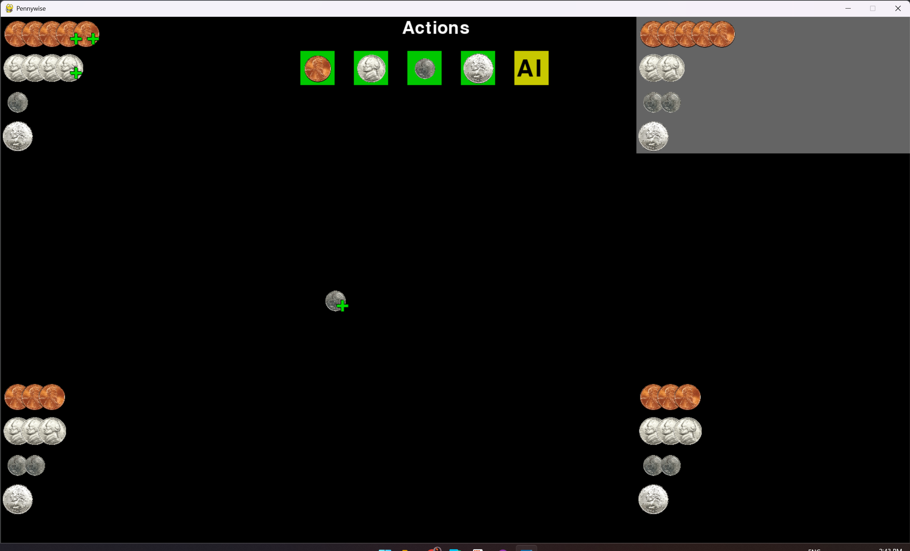
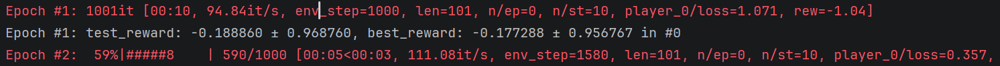

# Coin ML -- Creating an AI to play Pennywise

While playing James Ernest's game [Pennywise](https://www.youtube.com/watch?v=eyE1CzW_Rcs) with my son, we were inspired to see if we could create an AI that was able to play the game "decently well"--that is, good enough it could compete with us.

My son discovered the game in Ben Orlin's [Math Games with Bad Drawings](https://mathwithbaddrawings.com/2022/01/19/math-games-with-bad-drawings-2/)

With a lot of internet searching and trial and error, we got to place where the AI is officially Not Bad (tm).

## Our Approach

We had 3 big areas to solve:
1. How do we represent the game to the computer?
2. What AI algoritm do we use for training?
3. How do we play against our AI?

We discovered 2 very powerful tools to help: PettingZoo and TianShou.

## Representing the game: PettingZoo
https://pettingzoo.farama.org/

We started with PettingZoo. PettingZoo is a library that makes it easy for computers to understand the rules of a game. It did 3 very useful things for us:
1. It gave us an idea for how machines represent games.
2. It gave us an example of a simple game (tictactoe) we could start with
3. It has a built in API for _rendering_ the game, which meant we could see the results of our game in a human friendly way.

## Training: TianShou
https://tianshou.org/en/stable/

Early on, we decided to use a neural network as our algorithm. We tried a lot of different approaches and failed a lot, too.
We settled on using an old version of TianShou (0.5.0) as we found an existing tic-tac-toe example we could use as our starting point.

Very roughly, the neural network "learns" to play the game by looking at the game state (how many coins are in everyone's hands, and how many are in the pot), and then choosing an action.
After the game is over, it looks back at all of the choices it made. If it _won_, it treats those choices as "potentially good". If it _lost_, it treats those choices as "potentially bad".
At first, it is playing randomly. But it repeats that process thousands of times, and slowly the "good" choices start to form mathmatical patterns that add up to something that looks
reasonable!

 _The 1st and 2nd epoch of a training run, each with 1000 games._

This was all good in theory, but in practice it was failing. A lot. Even with a lot of training, the AI was doing stupid things, like starting by playing a quarter, or ignoring a juicy play
in favor of feeding pennies to a neighbor.

There were at least 3 really important things we learned that helped us get to a good AI: a *good heuristic*, *league play*, *randomized starting conditions*.

### Heuristic Rewards

One big issue when a computer tries to learn to play a game is that it either wins or loses. And when there are 4 players, it loses  a _lot_. This is a problem for us, because it wasn't finding enough "potentially good" moves to play.

It's possible that we could solve this by training the AI even more (with millions of games!), but we wanted a short-cut. My son proposed a simple heuristic to help the AI recogize if a move was good or bad. Rather than only rewarding wins, we also give a tiny reward for making "reasonable" plays. We look at the value _gained_ divided by the value _spent_ (for example, if you play a nickel and take 3 pennies, you get a mini-reward of 0.6; if you play a dime and take nothing, you get a mini-reward of 0). We tried a few other heuristics, but this 'value' metric worked the best in our tests.

### League Play

At first, we tried to train the AI using *self-play*, where it played against itself and tried to improve. However, we never really got that to work. The AI would continue to make bad moves and did not get better. However, we noticed that if the AI played against _random_ agents, it was able to consistently beat those. That lead us to league play, where the AI plays against *previous versions of itself*. That does 2 awesome things: it makes it much easier for the AI to detect when it has improved, and it avoided "catastrophic forgetting", where the AI would "unlearn" something spontaneously (like hold on to those quarters!)

### Starting Conditions

The last major improvement was in the starting conditions. Because the AI always was the 1st player, it wasn't winning very much! If everyone plays randomly, the first player wins about 14% of the time, and the last player 34% of the time. This lead the AI to assume it needed "hail mary" plays to have a chance of winning.

My son's suggestion to solve this was pretty brilliant: start training the AI as if the game was already in progress. 25% of the time the pot starts empty, but the rest of the time it starts with some coins already in it, as if other players had already gone. This removed the first player disadvantage, which meant the AI was able to win more games and learn better plays.

## Playing: PyGame

PettingZoo already has built in support to render a game that is being played. With a bit of clever code, we hooked up buttons that allow a human to either pick a coin to play, or to let the AI decide.

When you let the AI pick, we print out the logits. These represent the confidence that the AI has in each possible action. For our program, we always pick the highest one, but if you think that the AI made a mistake, you can look at the action and see if it was a close decision.
<code>
AI Q-Values:     -0.161     -0.233   [ -0.147]    -0.323 
AI Q-Values:   [  0.074]    -0.007     -0.119     -0.216 
AI Q-Values:      0.042   [  0.174]     0.007     -0.057 
AI Q-Values:   [  0.065]    -0.044     -0.107     -0.268 
</code>

# The Code
...is a bit of a mess. We didn't originally intend to make it public, but it was too cool not to share. The key files are:
* [pennywise.py](pennywise.py) has the PettingZoo environment
* [main_pennywise.py](main_pennywise.py) has the TianShou training. there are a lot of parameters, our final run used `--league --epoch=1000 --train-agents 0 1 1 1 --test-agents 0 3 3 3`
* [play.py](play.py) allows humans to play and see the AI play step-by-step

## AI Disclosure

AI helped us make this AI! We used Google Gemini frequently to ask for ideas and code snippets. Parts of the code in this repository are copied from Gemini.
